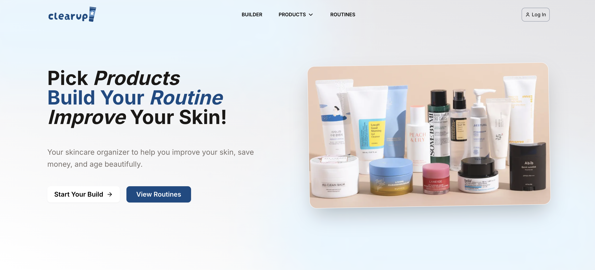
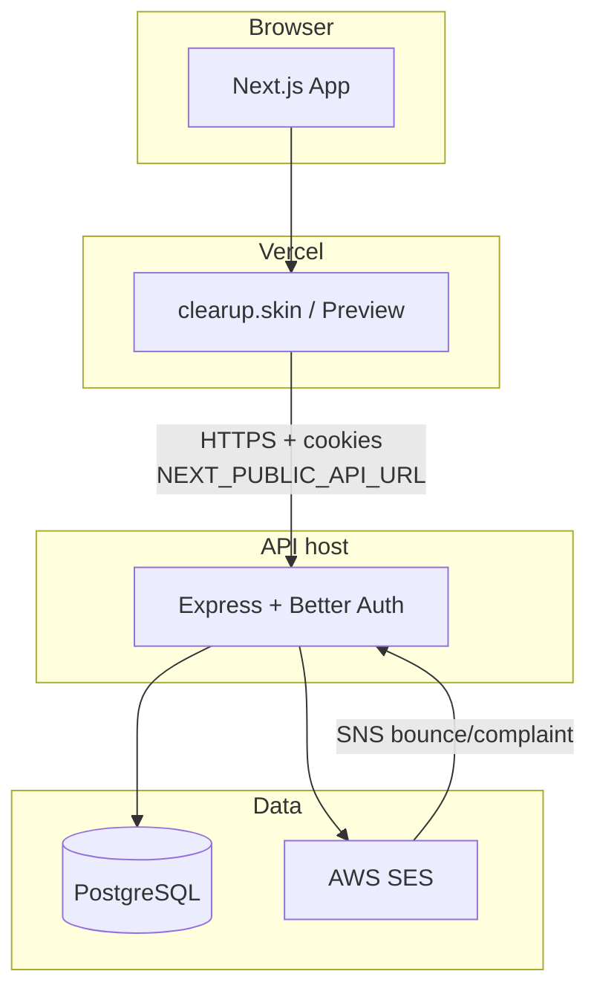

# Clearup

Website Link: [clearup.skin](https://www.clearup.skin)!





Clearup is a skincare organizer platform. Users can browse skincare product catalogs, compare seller prices, build step by step routines in a visual builder, and share them to the their friends and family. 

## What Clearup Does

Clearup is basically a database of products. Its product information is gathered via a data scraper (same developer is working on it so, thank you for your patience!). It holds important information that makes it easily visible for users, like what skin types a product supports, the ingredients, the formulation, and more. Users can also filter specific information like the brands they enjoy or the skin type the product supports.

A service Clearup provides is an builder for your routine, where you can create a routine that works for you from the product catalog. It saves the information so you can click off and continue to update it until it's ready to be saved! You can also add the order in which the product are used.

Once you save your routine, you have a link carry that information (if you're logged in, I would do logged out too but I'm still a local developer). This will automatically go into the community routine tab where anyone can see and learn from what you use (or what you want to use).


# Developer Focused Information

## Repository layout

```
ClearUp/
├── frontend/                   # Next.js app 
├── backend/                    # Express API
│   ├── docker-compose.yml      # Local Postgres only
│   ├── docs/modules/           # backend module notes (for legacy)
│   └── testREADME.md           # API testing & troubleshooting
└── LICENSE                     # MIT
```

## Architecture

ClearUp is a **split-stack monorepo**: a Next.js frontend talks to a standalone Express API over HTTP. Both run on **Bun**. PostgreSQL is the single source of truth for products, routines, merchants, and auth.

| Layer | Stack | Hosting |
| ----- | ----- | ------- |
| **Frontend** | Next.js 16, React 19, TypeScript, Tailwind CSS v4 | Prod: [Vercel](https://vercel.com), Staging: Vercel Preview, Dev: `http://localhost:3000` |
| **Backend** | Express 5, TypeScript, Sequelize 6 | Prod: AWS EC2 t3.micro (Ubuntu, Caddy), Staging: Render, Dev: `http://localhost:5050` |
| **Database** | PostgreSQL via Sequelize + Umzug migrations | Prod: Supabase pooler, Staging: Supabase pooler, Dev: Docker Postgres |
| **Auth** | [Better Auth](https://www.better-auth.com) (sessions + Google OAuth) | Runs on the API; frontend is a cookie-aware client |
| **Email** | AWS SES v2 | Verification, password reset; SNS webhook for bounces/complaints |

**Key dependencies**

- Frontend: `better-auth`, `radix-ui` / shadcn, `framer-motion`, `@vercel/analytics`, `@vercel/speed-insights`
- Backend: `better-auth`, `sequelize`, `pg`, `umzug`, `@aws-sdk/client-sesv2`, `express-rate-limit`, `compression`

**How the pieces connect**

1. The frontend calls `NEXT_PUBLIC_API_URL` with `credentials: "include"` so Better Auth session cookies flow cross-origin (CORS + trusted origins must align).
2. Catalog reads use Next.js Data Cache (`revalidate` tiers in `src/lib/products.ts`); mutations use `cache: "no-store"` and a custom `x-clearup-client: 1` header for CSRF mitigation on routine writes.
3. On API boot: `sequelize.authenticate` → model associations → `sequelize.sync()` → Umzug migrations.
4. Auth is **application-level** (`requireAuth`, `requireAdmin`, ownership checks), not just Postgres RLS.



## Frontend

Regarding design: this frontend is generally inspired by [PCPartPicker](https://pcpartpicker.com/) and various skincare websites. Since I am the sole developer, I decided to keep this application strict to its few services, but do them very well.

Shoutout to:
- Nich Wilson for UI, marketing, and admin management
- My mom and sister, and Kelly Marks for UI/UX testing
- Stella Ngo for logo design

### Structure

Next.js **App Router** with route groups and a `@/*` path alias:

```
frontend/src/
├── app/
│   ├── (main)/          # Header + footer shell — catalog, builder, routines, profile
│   ├── (auth)/          # login, register, verify-email, forgot/reset password
│   ├── (info)/          # about, FAQ, privacy, TOS, contact
│   └── admin/           # role-gated dashboard (server layout check)
├── components/          # ui/, product/, routine/, guides/, home/, admin/, auth/
├── hooks/               # useBuilderRoutine, useEffectiveRole, catalog hooks
├── lib/                 # API clients (products, routines, auth, merchants)
├── types/               # shared TypeScript types
└── constants/           # filters, mail, country mapping
```

- **Server Components** for data-heavy pages (catalog, routines, PDP).
- **Client Components** for interactivity (builder, auth forms, filters).
- **`loading.tsx`** skeletons on major async routes.

### State & data fetching

| Concern | Approach |
| ------- | -------- |
| Auth session | `better-auth/react` via `authClient.useSession()` |
| Admin role | `useEffectiveRole` → `GET /api/auth/me` |
| Builder draft | `localStorage` (`builder-routine`) via `useBuilderRoutine` |
| Server cache | `fetch` with `revalidate` tiers in `lib/products.ts` / `lib/routines.ts` |
| Cross-tab sign-out | `BroadcastChannel` in `useCrossTabSignOut` |

Hooks + Better Auth + Next.js cache only.

### The frontend patterns

**Loading**: Each important async page has skeleton loaders (`loading.tsx`), inspired by apps like YouTube.

**Reduced API calls + speed**: Tiered `revalidate` caching in `src/lib/products.ts`:

| Constant | TTL | Use |
| -------- | --- | --- |
| `CATALOG_REVALIDATE_SEC` | 1h | Category grids + PDP product body |
| `PRODUCT_MERCHANTS_REVALIDATE_SEC` | 30m | Per-product merchant offers on PDP |
| `BATCH_MERCHANT_OFFERS_REVALIDATE_SEC` | 6h | Batched offers on routine pages |

Mutations always use `cache: "no-store"` and `mutationHeaders()` (`x-clearup-client: 1`).

**Progress saver**: The builder stores a slim JSON snapshot in `localStorage` so grid slots and notes survive navigation before save.

**Images**: Product images are not hosted natively; they load from retailer CDNs (YesStyle, Sephora, etc.) via `next/image` `remotePatterns`. `next/image` optimization applies to those remotes. I do want to implement an 
profile picture + image comments for routines in the future.

**Styling** — Tailwind CSS, shadcn/ui primitives (`components/ui/`), Inter + Geist fonts, `framer-motion` for scroll reveals and auth-page motion. I want to formalize all the CSS variables that I use though (will refractor!).


## Backend

### Layered design

```
routes → controllers → services → repositories → models
```

Each HTTP concern stays at the controller; business logic lives in services, and SQL stays in repositories. Controllers validate input and map responses to the repositories, being the only layer that talks to Sequelize.

```
backend/src/
├── index.ts              # Express bootstrap, middleware, route mounting
├── db.ts                 # Sequelize singleton
├── associations.ts       # model relationships
├── config/               # auth, pagination, product categories
├── routes/               # product, routine, merchant, user, webhook
├── controllers/          # HTTP handlers
├── services/             # business logic
├── repositories/         # DB queries
├── models/               # Sequelize models
├── middleware/           # requireAuth, rate limits, CSRF header, CSV parse
├── migrations/           # Umzug 001–009
└── lib/                  # dbConfig, SES, CSV import, security helpers
```

### Boot sequence

1. CORS (`TRUSTED_ORIGINS`, `credentials: true`) + `trust proxy`
2. Webhook route (raw body) before JSON parser
3. Global rate limit (300 / 15 min), compression
4. Auth stack on `/api/auth` (rate limits + audit logging)
5. Feature routes: `/api/users`, `/api/products`, `/api/routines`, `/api/merchant`
6. `GET /health` — DB connectivity probe
7. `validateSecurityConfig` → `sequelize.authenticate` → associations → `sync()` → `runMigrations()` → `listen`

### Models

| Domain | Models |
| ------ | ------ |
| Auth (Better Auth) | `User`, `Session`, `Account`, `Verification` |
| Catalog | `Product`, `Merchant`, `ProductMerchant` |
| Routines | `Routine`, `RoutineProduct`, `FeaturedRoutine` |

Schema evolves via **Umzug migrations** (stored in `sequelize_meta`); `sequelize.sync()` on boot creates missing tables non-destructively.

### Auth & security

- **Better Auth** on Express handles sign-up, sign-in, Google OAuth, and sessions. The frontend never holds a JWT — it forwards cookies.
- **`requireAuth`** resolves the session, hydrates the user from DB if needed, and promotes `ADMIN_EMAILS` whitelist entries to `role: "admin"`.
- **`requireAdmin`** gates admin routes and CSV imports.
- **`requireMutationHeader`** on routine POST/PUT/PATCH/DELETE — blocks cross-origin form CSRF.
- **Rate limits:** global 300/15 min; routine POST 10/hr; routine mutations 60/15 min; merchant POST 10/hr; dedicated auth brute-force limiters.
- **Email:** SES for verification and password reset; `/api/webhooks/aws-ses` (SNS) updates `user.emailStatus` on bounces/complaints.

**OAuth note:** redirect URIs must point at the **API host** (e.g. `http://localhost:5050/api/auth/callback/google`), not the Next.js port. When frontend and API are on different origins in production, set `BETTER_AUTH_CROSS_SITE_COOKIES=1`.


## Local Start

**Prerequisites:** [Bun](https://bun.sh), [Docker](https://www.docker.com/).

### 1. Database

```bash
cd backend
docker compose up -d
```

Postgres listens on `localhost:5432` (`skincare` / `postgres` / `password123` per `docker-compose.yml`).

### 2. API

Create `backend/.env` using `backend/.env.example` (if in `NODE_ENV=development`, set `DATABASE_URL= ` nothing):

```bash
cd backend
bun install
bun dev
```

Migrations apply on boot. Health check: `GET http://localhost:5050/health`.

Run `bun run seed:merchants` for sellers (will add a admin endpoint eventually).

### 3. Frontend

Create `frontend/.env` using `frontend/.env.example`:

```bash
cd frontend
bun install  
bun  dev  
```

Open [http://localhost:3000](http://localhost:3000).

> **Port note:** The API defaults to `5000` in code if `PORT` is unset; the frontend defaults to `5050`. Set `PORT=5050` locally so docs, OAuth redirects, and `NEXT_PUBLIC_API_URL` stay aligned.

## API surface (summary)

| Prefix                  | Auth         | Role                                    |
| ----------------------- | ------------ | --------------------------------------- |
| `/api/auth/*`           | Better Auth  | Sign-up, sign-in, OAuth, sessions       |
| `GET /api/auth/me`      | Session      | Current user `{ id, email, role }`      |
| `/api/products`         | Mixed        | Catalog CRUD; admin for writes/imports  |
| `/api/routines`         | Mixed        | Routines, guides, featured, admin stats |
| `/api/merchant`         | Admin writes | Merchant master data                    |
| `/api/users/admin`      | Admin        | User listing                            |
| `/api/webhooks/aws-ses` | SNS          | Bounce/complaint handling               |
| `/health`               | Public       | DB connectivity probe                   |

Rate limits: global (300 / 15 min), stricter caps on routine/merchant POST and auth brute-force paths.

## Frontend routes (high level)

| Path                        | Description                                    |
| --------------------------- | ---------------------------------------------- |
| `/`                         | Landing: hero, featured routines, how it works |
| `/products/category/[slug]` | Category product grid                          |
| `/product/id/[slug]`        | Product detail + merchant offers               |
| `/builder`                  | Routine builder (local + save)                 |
| `/routine/[id]`             | Shared routine view                            |
| `/routines`                 | Community routines with filters (`/guides` redirects here) |
| `/profile/*`                | Saved/created routines, preferences            |
| `/login`, `/register`, …    | Auth flows                                     |
| `/admin/*`                  | Admin dashboard (role-gated)                   |

## Command Scripts

**Backend (`backend/`):**

| Command                               | Description                        |
| ------------------------------------- | ---------------------------------- |
| `bun dev`                             | Watch mode API                     |
| `bun run build` / `bun run start`     | Production compile + run           |
| `bun run migrate:up` / `migrate:down` | Umzug migrations                   |
| `bun run seed`                        | Dev seed (wipes via `force: true`) |
| `bun run seed:merchants`              | Seed merchant master data from CSV   |
| `bun run test:ses`                    | Send test email via SES            |

**Frontend (`frontend/`):**

| Command                   | Description                      |
| ------------------------- | -------------------------------- |
| `bun dev`                 | Run development frontend         |
| `bun run build` / `start` | Production build                 |
| `bun run analyze`         | Bundle analysis (`ANALYZE=true`) |

## Feature documentation

Backend module notes remain under `backend/docs/modules/` for controller/service/repository detail.

## License

MIT — see [LICENSE](LICENSE). Copyright (c) 2025 Anthony Pham.

## Contact

Anthony Pham — phamanthony47@gmail.com
