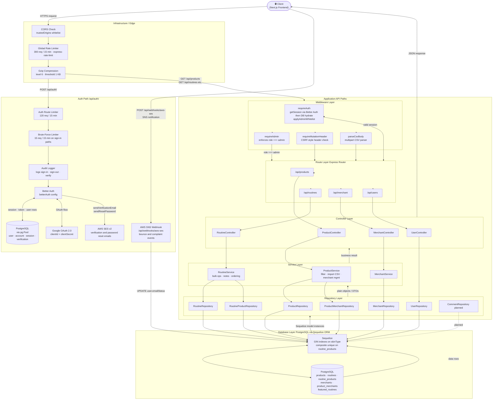

# ClearUp — Backend Architecture

> **Stack**: Node.js · Express · TypeScript · Sequelize ORM · PostgreSQL · Better Auth · AWS SES / SNS

---

## 1. Entity-Relationship (ER) Diagram

> Models live in `backend/src/models/`. Associations are wired in `backend/src/associations.ts`.
> Better Auth owns `user`, `account`, `session`, and `verification` (managed via its own `pg` Pool).
> Application logic owns the remaining tables.

```mermaid
erDiagram
    %% ─────────────────────────────────────────────
    %% AUTH LAYER  (managed by Better Auth)
    %% ─────────────────────────────────────────────

    USER {
        string  id              PK
        string  name
        string  email           UK
        boolean emailVerified
        string  emailStatus     "active | bounced | complained"
        string  image
        string  role            "user | admin"
        boolean banned
        string  banReason
        date    banExpires
        date    createdAt
        date    updatedAt
    }

    ACCOUNT {
        string  id                    PK
        string  accountId
        string  providerId            "credential | google"
        string  userId                FK
        text    accessToken
        text    refreshToken
        text    idToken
        date    accessTokenExpiresAt
        date    refreshTokenExpiresAt
        string  scope
        string  password              "hashed; credentials only"
        date    createdAt
        date    updatedAt
    }

    SESSION {
        string  id          PK
        date    expiresAt
        string  token       UK
        string  ipAddress
        string  userAgent
        string  userId      FK
        date    createdAt
        date    updatedAt
    }

    VERIFICATION {
        string  id          PK
        string  identifier  "email address"
        text    value       "signed token"
        date    expiresAt
        date    createdAt
        date    updatedAt
    }

    %% ─────────────────────────────────────────────
    %% APPLICATION LAYER
    %% ─────────────────────────────────────────────

    ROUTINE {
        int     id              PK
        string  name
        text    description     "user notes; JSON-safe"
        string  userId          FK
        string[]  skinTypeTags  "oily | dry | combo | sensitive | normal | acne-prone"
        date    createdAt
        date    updatedAt
    }

    PRODUCT {
        int     id              PK
        string  name
        string  brand
        string  category        "ENUM from productCategories"
        string[]  labels
        string[]  skinType      "GIN-indexed array"
        string  country
        string  capacity
        float   price
        text[]  instructions
        string  activeIngredient
        text    ingredients
        text[]  imageUrls
        float   averageRating
        int     reviewCount
        string[]  tags
    }

    ROUTINE_PRODUCT {
        int     id              PK "join table"
        int     routineId       FK
        int     productId       FK
        string  category        "ENUM — denormalized; display uses products.category"
        text    amNote          "AM usage note"
        text    pmNote          "PM usage note"
        int     amStepOrder
        int     pmStepOrder
        date    createdAt
        date    updatedAt
    }

    MERCHANT {
        int     id      PK
        string  name
        string  logo
    }

    PRODUCT_MERCHANT {
        int     id          PK
        int     productId   FK
        int     merchantId  FK
        string  website     "buy link"
        float   price       "merchant-specific price"
        boolean stock
        string  shipping
        date    lastUpdated
    }

    FEATURED_ROUTINE {
        int     id          PK
        int     routineId   FK  UK
        string  pinnedBy    "admin userId"
        date    createdAt
        date    updatedAt
    }

    COMMENT {
        int     id           PK  "schema only — not yet wired"
        int     productId    FK
        string  userId       FK
        string  content
        int     helpfulCount
        date    createdAt
    }

    %% ─────────────────────────────────────────────
    %% RELATIONSHIPS
    %% ─────────────────────────────────────────────

    %% Auth relations (CASCADE on delete)
    USER         ||--o{  ACCOUNT          : "has many (CASCADE)"
    USER         ||--o{  SESSION          : "has many (CASCADE)"

    %% Core app relations (CASCADE on delete)
    USER         ||--o{  ROUTINE          : "has many (CASCADE)"
    ROUTINE      ||--o{  ROUTINE_PRODUCT  : "has many (CASCADE)"
    PRODUCT      ||--o{  ROUTINE_PRODUCT  : "used in"
    ROUTINE      }o--o{  PRODUCT          : "belongsToMany via ROUTINE_PRODUCT"

    %% Merchant relations
    PRODUCT      ||--o{  PRODUCT_MERCHANT : "sold at"
    MERCHANT     ||--o{  PRODUCT_MERCHANT : "sells"
    PRODUCT      }o--o{  MERCHANT         : "belongsToMany via PRODUCT_MERCHANT"

    %% Admin curation
    ROUTINE      ||--o|  FEATURED_ROUTINE : "featured by admin"

    %% Future — product reviews
    PRODUCT      ||--o{  COMMENT          : "receives (planned)"
    USER         ||--o{  COMMENT          : "writes (planned)"
```

---

## 2. Request Lifecycle Flowchart

> Traces a request from the client through every layer down to the database and external services.
> The auth sub-flow (Better Auth) is shown as its own path.



---

## 3. Component Summary

| Layer | Files | Responsibility |
|---|---|---|
| **Entry** | `src/index.ts` | Express app bootstrap, middleware wiring, route mounting, DB sync + migrations |
| **Config** | `src/config/auth.ts` | Better Auth instance — Google OAuth, email/password, admin plugin, SES hooks |
| **Config** | `src/db.ts` | Sequelize instance pointing at PostgreSQL (local Docker or cloud via `DATABASE_URL`) |
| **Models** | `src/models/*.ts` | Sequelize model classes — schema source of truth |
| **Associations** | `src/associations.ts` | FK constraints + Sequelize `hasMany` / `belongsToMany` wiring |
| **Middleware** | `src/middleware/requireAuth.ts` | `requireAuth` + `requireAdmin` — session validation, admin whitelist hydration |
| **Middleware** | `src/middleware/security.ts` | Auth route rate limiting, brute-force limiter, audit logger |
| **Middleware** | `src/middleware/parseCsvBody.ts` | Multipart CSV parser for admin product import |
| **Middleware** | `src/middleware/requireMutationHeader.ts` | CSRF-style header check on mutation routes |
| **Routes** | `src/routes/*.ts` | URL-to-handler mapping; applies per-route middleware (auth guards, rate limits) |
| **Controllers** | `src/controllers/*.ts` | HTTP request/response handling; delegates to services |
| **Services** | `src/services/*.ts` | Business logic: product filtering, CSV import, routine bulk ops, notes ordering |
| **Repositories** | `src/repositories/*.ts` | Direct Sequelize queries; abstraction boundary between services and ORM |
| **Lib** | `src/lib/sesEmail.ts` | AWS SES v2 transactional email sender (respects `emailStatus`) |
| **Lib** | `src/lib/dbConfig.ts` | DB URL + SSL resolution for local vs. cloud environments |
| **Webhooks** | `src/routes/webhookRoutes.ts` | AWS SNS webhook — confirms subscription, handles bounce/complaint to update `emailStatus` |

---

## 4. External Service Integrations

| Service | Purpose | Direction |
|---|---|---|
| **AWS SES v2** | Transactional email (verification, password reset) | Outbound |
| **AWS SNS** | Bounce & complaint notifications → update `user.emailStatus` | Inbound webhook |
| **Google OAuth 2.0** | Social sign-in via Better Auth `socialProviders.google` | Outbound OAuth redirect |
| **PostgreSQL** | Primary data store (Docker locally; cloud in production) | Bidirectional |

---

## 5. Rate Limiting Summary

| Limiter | Scope | Window | Max |
|---|---|---|---|
| `globalLimiter` | All routes | 15 min | 300 req |
| `authRouteLimiter` | `/api/auth/*` | 15 min | 120 req |
| `authBruteForceLimiter` | Sign-in / reset / verify paths | 15 min | 15 req |
| `createStrictLimiter` | `POST /api/routines` + `POST /api/merchant` | 1 hour | 10 req |
| `routineMutateLimiter` | `PUT/PATCH/DELETE /api/routines` | 15 min | 60 req |
